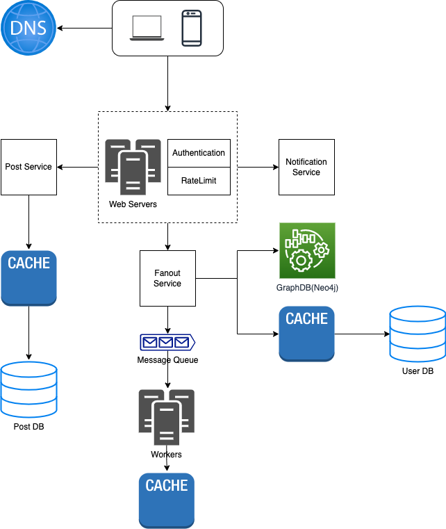
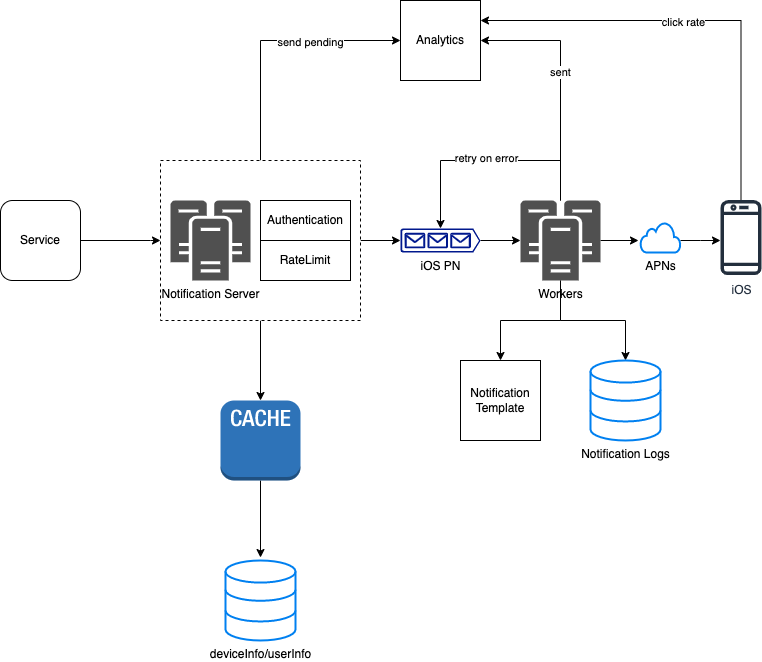
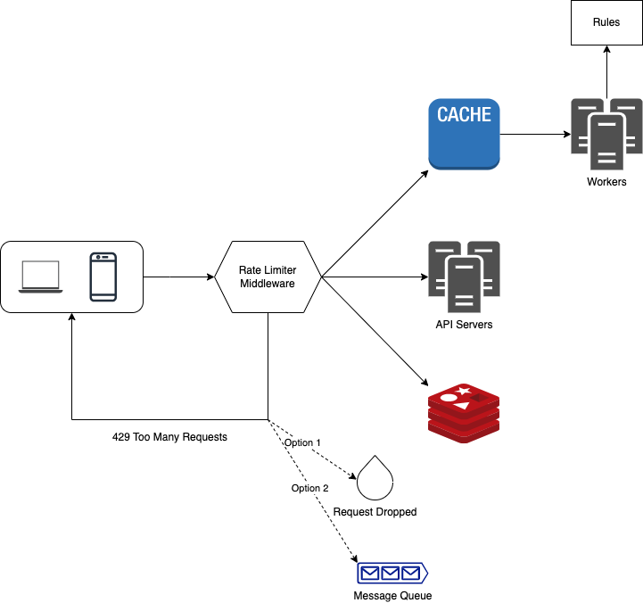
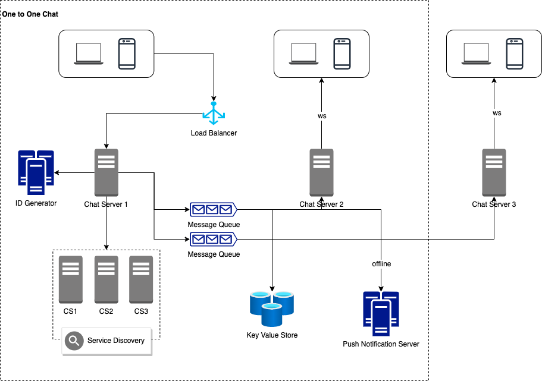
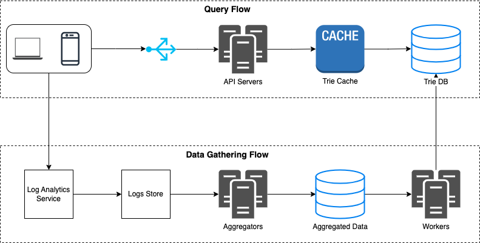
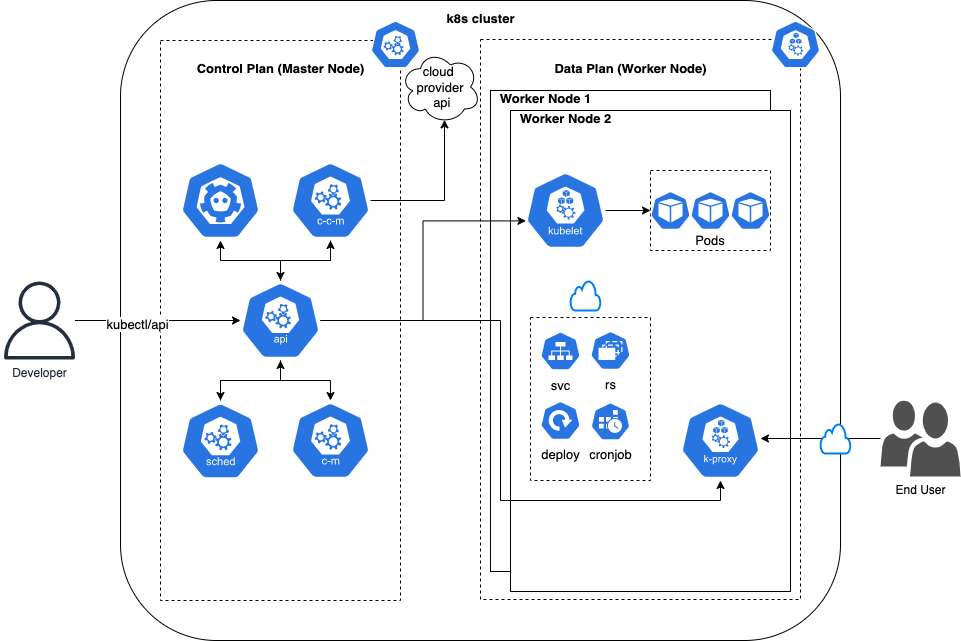
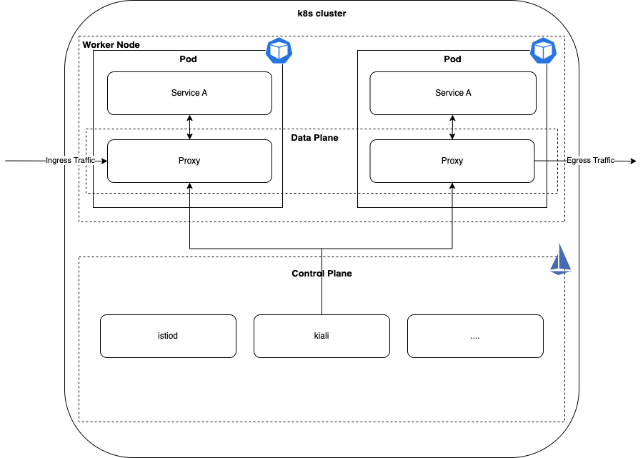

# Architecture Diagrams
This repository contains diagrams of popular software systems and components.

* Diagrams are built using [draw.io](https://app.diagrams.net/). Learn more about it from [youtube](https://www.youtube.com/@drawioapp) and [website](https://drawio-app.com/)
* The source of diagrams are mentioned in below table.

## List of Diagrams

### Services
| About               | Diagram                                                                      | Source                                              |       
|---------------------|------------------------------------------------------------------------------|-----------------------------------------------------| 
| News Feed           |            | [System Design By Alex Xu](https://bytebytego.com/) | 
| Notification        |        | [System Design By Alex Xu](https://bytebytego.com/) |
| Rate Limiter        |         | [System Design By Alex Xu](https://bytebytego.com/) |
| Chat System         |          | [System Design By Alex Xu](https://bytebytego.com/) |
| Autocomplete System |  | [System Design By Alex Xu](https://bytebytego.com/) |

### Cloud Native Components
| About        | Diagram                                                                  | Source                                                                                                                                                         |       
|--------------|--------------------------------------------------------------------------|----------------------------------------------------------------------------------------------------------------------------------------------------------------| 
| k8s          |          | [Blog](https://medium.com/devops-mojo/kubernetes-architecture-overview-introduction-to-k8s-architecture-and-understanding-k8s-cluster-components-90e11eb34ccd) | 
| Service Mesh |  | [Official Website](https://istio.io/latest/docs/ops/deployment/architecture/)                                                                                                                    |                                                                                                        |

## Contributing
Have you built certain architecture diagrams with draw.io which you would like to share with everyone? You're welcome to contribute with a pull request! (Credits will be given to you)

Let's build awesome diagrams together.