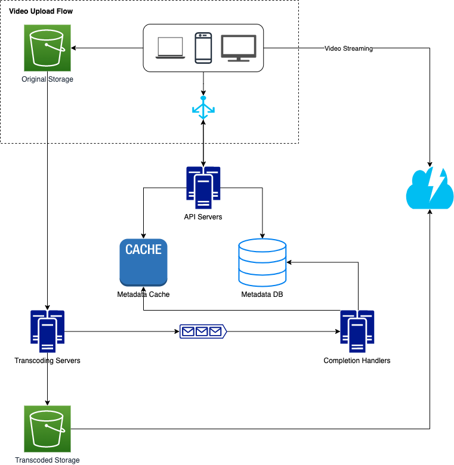
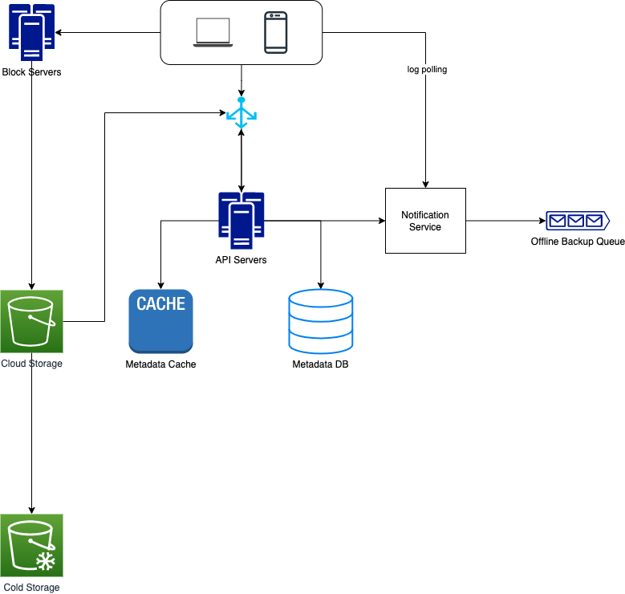
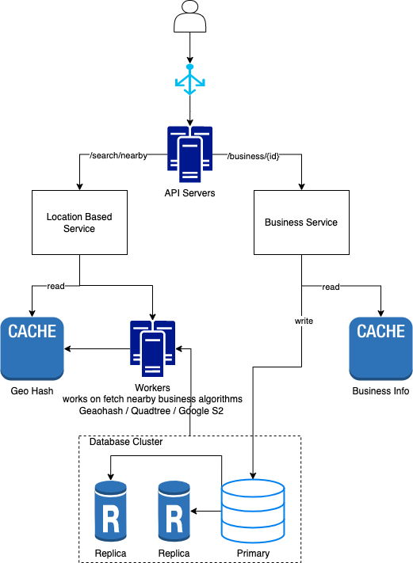
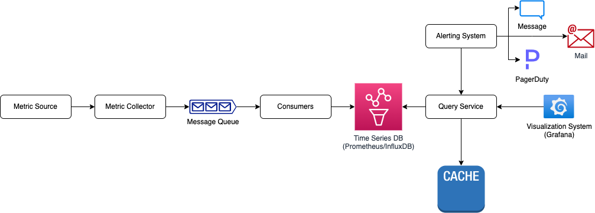
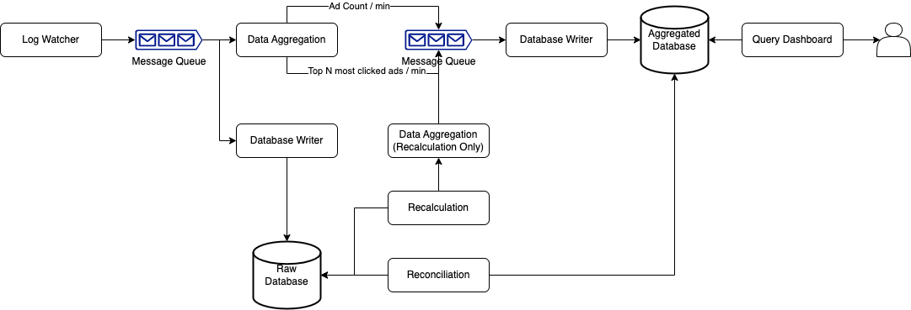
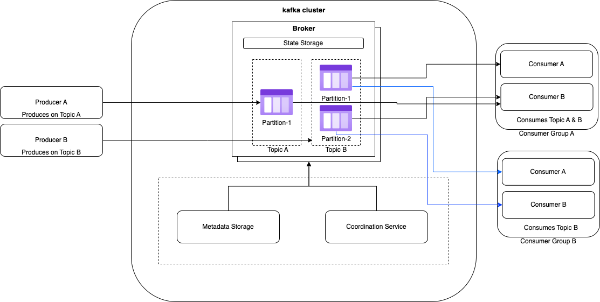

# Architecture Diagrams
This repository contains diagrams of popular software systems and components.

* Diagrams are built using [draw.io](https://app.diagrams.net/). Learn more about it from [youtube](https://www.youtube.com/@drawioapp) and [website](https://drawio-app.com/)
* The source of diagrams are mentioned in below table.

## List of Diagrams
 
### Services
| About                     | Example                      | Diagram                                                                                | Source                                              |       
|---------------------------|------------------------------|----------------------------------------------------------------------------------------|-----------------------------------------------------| 
| News Feed                 | Twitter,Facebook Home Page   |                      | [System Design By Alex Xu](https://bytebytego.com/) | 
| Notification              |                              |                  | [System Design By Alex Xu](https://bytebytego.com/) |
| Rate Limiter              |                              |                   | [System Design By Alex Xu](https://bytebytego.com/) |
| Chat System               | Whatsapp, Facebook Messenger |                    | [System Design By Alex Xu](https://bytebytego.com/) |
| Autocomplete              |                              |            | [System Design By Alex Xu](https://bytebytego.com/) |
| Video Streaming           | Youtube                      |                | [System Design By Alex Xu](https://bytebytego.com/) |
| Cloud Storage             | Google Drive, Dropbox        |                  | [System Design By Alex Xu](https://bytebytego.com/) |
| Proximity                 | Google Maps, Yelp            |                     | [System Design By Alex Xu](https://bytebytego.com/) |
| Monitoring And Alerting   |                              |  | [System Design By Alex Xu](https://bytebytego.com/) |
| Ad/Link Click Aggregation | Google Ads, Facebook Ads     |            | [System Design By Alex Xu](https://bytebytego.com/) |

### Cloud Native Components
| About                                     | Example                | Diagram                                                          | Source                                                                                                                                                         |       
|-------------------------------------------|------------------------|---------------------------------------------------------------------------|----------------------------------------------------------------------------------------------------------------------------------------------------------------| 
| k8s                                       |                        |          | [Blog](https://medium.com/devops-mojo/kubernetes-architecture-overview-introduction-to-k8s-architecture-and-understanding-k8s-cluster-components-90e11eb34ccd) | 
| Service Mesh                              | istio                  |  | [Official Website](https://istio.io/latest/docs/ops/deployment/architecture/)                                                                                  |
| Message Queue / Event Processing Platform | Apache Kafka, RabbitMQ | | [System Design By Alex Xu](https://bytebytego.com/)                                                                                                            |

## Contributing
Have you built certain architecture diagrams with draw.io which you would like to share with everyone? You're welcome to contribute with a pull request! (Credits will be given to you)

Let's build awesome diagrams together.